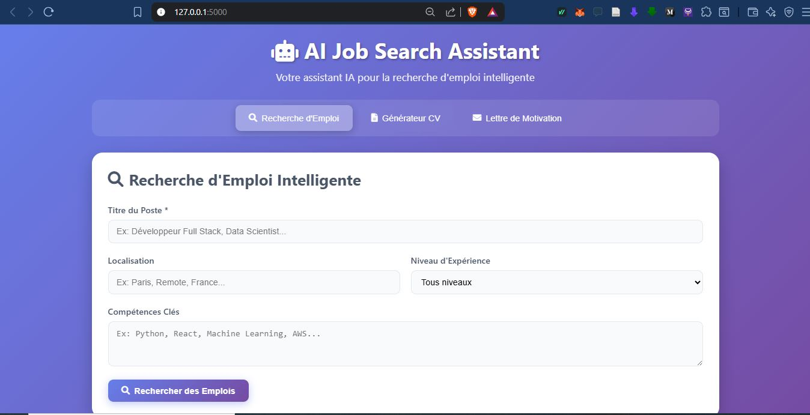
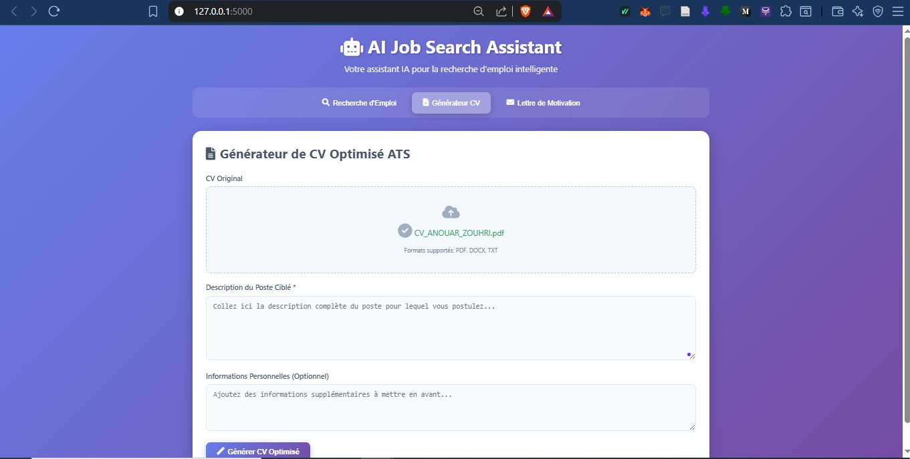
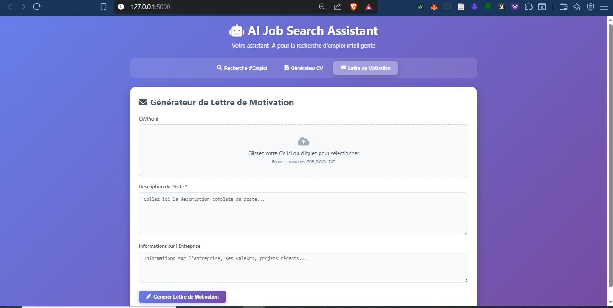

# 🤖 AI Job Search Assistant
**Votre assistant IA pour la recherche d'emploi intelligente**

Un système complet de 3 agents IA pour optimiser votre recherche d'emploi, utilisant l'**API Google Gemini** et une interface web moderne et intuitive.

## ✨ Aperçu de l'Interface

L'application propose une interface web élégante avec 3 modules principaux accessibles via des onglets :

### 🔍 **Recherche d'Emploi Intelligente**
- Interface de recherche avancée avec filtres multiples
- Champs : Titre du poste, Localisation, Niveau d'expérience, Compétences clés
- Recherche simultanée sur LinkedIn, Indeed, Glassdoor, Monster
- Analyse et classement intelligent des résultats

- 

### 📄 **Générateur de CV Optimisé ATS**
- Upload de CV par glisser-déposer (PDF, DOCX, TXT)
- Zone de saisie pour la description du poste cible
- Personnalisation automatique basée sur l'offre d'emploi
- Export en code LaTeX compatible Overleaf

- 

### 💌 **Générateur de Lettre de Motivation**
- Upload de CV/profil pour analyse du background
- Saisie de la description complète du poste
- Zone pour informations sur l'entreprise (valeurs, projets récents)
- Rédaction personnalisée et professionnelle

- 

## 🚀 Caractéristiques Principales

### Interface Moderne
- **Design responsive** : S'adapte à tous les écrans (desktop, tablette, mobile)
- **Interface intuitive** : Navigation par onglets claire et ergonomique
- **Upload drag & drop** : Glisser-déposer vos fichiers facilement
- **Feedback visuel** : Messages de statut et indicateurs de progression

### IA Avancée avec Google Gemini
- **Analyse contextuelle** : Compréhension approfondie des offres d'emploi
- **Personnalisation intelligente** : Adaptation automatique du contenu
- **Optimisation ATS** : CV formatés pour passer les filtres automatiques
- **Recherche d'entreprise** : Informations contextuelles pour les lettres

## 🛠️ Installation et Configuration

### Prérequis
- Python 3.8+
- Clé API Google Gemini
- Navigateur web moderne

### Installation Rapide

1. **Cloner le repository**
```bash
git clone <repository-url>
cd ai-job-search-assistant
```

2. **Installer les dépendances**
```bash
pip install -r requirements.txt
```

3. **Configuration de l'API**
```bash
cp .env.example .env
# Éditer .env avec votre clé API Google Gemini
```

4. **Démarrer l'application**
```bash
python app.py
```

5. **Accéder à l'interface**
Ouvrir http://127.0.0.1:5000 dans votre navigateur

### Configuration Google Gemini API

1. Rendez-vous sur [Google AI Studio](https://makersuite.google.com/app/apikey)
2. Créez une nouvelle clé API
3. Ajoutez la clé dans votre fichier `.env` :
   ```env
   GOOGLE_API_KEY=your_google_gemini_api_key_here
   ```

## 🎯 Guide d'Utilisation

### 🔍 Module Recherche d'Emploi

1. **Titre du Poste** : Saisissez le poste recherché (ex: "Développeur Full Stack, Data Scientist...")
2. **Localisation** : Précisez la zone géographique (ex: "Paris, Remote, France...")
3. **Niveau d'Expérience** : Sélectionnez dans le menu déroulant
4. **Compétences Clés** : Listez vos technologies/compétences principales
5. Cliquez sur **"Rechercher des Emplois"**

### 📄 Module Générateur de CV

1. **Upload CV Original** : 
   - Glissez-déposez votre CV actuel
   - Formats supportés : PDF, DOCX, TXT
2. **Description du Poste** : Collez l'annonce complète du poste ciblé
3. **Informations Personnelles** (optionnel) : Ajoutez des détails supplémentaires
4. Cliquez sur **"Générer CV Optimisé"**
5. **Téléchargement** : Récupérez le code LaTeX pour Overleaf

### 💌 Module Lettre de Motivation

1. **Upload CV/Profil** : Votre CV pour analyser votre background
2. **Description du Poste** : L'annonce complète pour adaptation
3. **Informations Entreprise** : Valeurs, projets récents, culture d'entreprise
4. Cliquez sur **"Générer Lettre de Motivation"**
5. **Copie/Export** : Copiez le texte ou exportez en document

## ⚙️ Architecture Technique

### Structure du Projet
```
ai-job-search-assistant/
├── 📁 agents/                    # Agents IA spécialisés
│   ├── job_search_agent.py      # Recherche d'emploi
│   ├── cv_generator_agent.py    # Génération de CV
│   └── cover_letter_agent.py    # Lettres de motivation
├── 📁 static/                   # Ressources frontend
│   ├── 📁 css/
│   │   └── style.css           # Styles de l'interface
│   ├── 📁 js/
│   │   └── script.js           # Logique frontend
│   └── 📁 uploads/             # Fichiers uploadés
├── 📁 templates/               # Templates HTML
│   └── index.html              # Interface principale
├── 📄 app.py                   # Application Flask
├── 📄 requirements.txt         # Dépendances Python
├── 📄 .env.example            # Template configuration
└── 📄 README.md               # Documentation
```

### Stack Technologique
- **Backend** : Flask (Python), Google Gemini API
- **Frontend** : HTML5, CSS3, JavaScript vanilla
- **Upload** : File API, Drag & Drop
- **Export** : LaTeX, PDF, TXT
- **Styling** : CSS moderne avec gradients et animations

## 🎨 Fonctionnalités de l'Interface

### Design Responsive
- **Gradients dynamiques** : Interface colorée et moderne
- **Animations fluides** : Transitions et effets visuels
- **Icônes intuitives** : Navigation claire avec pictogrammes
- **Mobile-first** : Optimisé pour tous les appareils

### Expérience Utilisateur
- **Upload visuel** : Zone de drop avec feedback instantané
- **Messages d'état** : Informations de progression en temps réel
- **Validation des champs** : Vérification automatique des saisies
- **Copie en un clic** : Boutons de copie rapide intégrés

## 🔧 Optimisations ATS

Le générateur de CV produit des documents optimisés pour les systèmes de suivi des candidatures :

- **Format standardisé** : Structure reconnue par les ATS
- **Mots-clés stratégiques** : Intégration automatique des termes de l'offre
- **Sections claires** : Organisation logique et lisible
- **Évitement des éléments problématiques** : Pas de graphiques complexes
- **Code LaTeX propre** : Compatible avec Overleaf et autres éditeurs

## 📊 Modèles IA Disponibles

- **gemini-1.5-pro** : Modèle le plus avancé (recommandé pour la production)
- **gemini-1.5-flash** : Version rapide pour les tests
- **gemini-pro** : Version standard pour usage quotidien
---

**Développé avec ❤️ pour optimiser votre recherche d'emploi grâce à l'IA**
